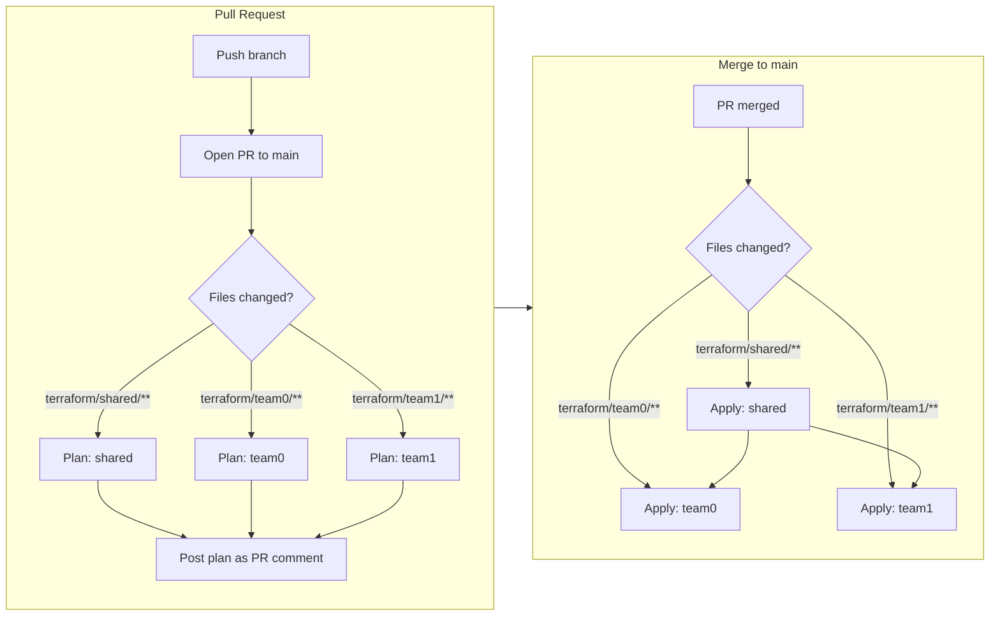

# AWS Knowledge Base Hackathon

A 4-day intensive hackathon to build an enterprise AI knowledge base on AWS using Terraform.

## Quick Links

- [Participant Guide](docs/participant-guide.md) — Setup instructions and hackathon overview
- [Requirements](docs/requirements.md) — Technical and functional requirements
- [Sprint Plan](docs/sprint-plan.md) — Day-by-day schedule and 2-team structure
- [Metadata Schema](docs/metadata-schema.md) — Shared contract between Team 0 and Team 1
- [Hands-On Exercise](docs/day1-hands-on-exercise.md) — Day 1 Terraform exercise

## Repository Structure

```
.
├── docs/
│   ├── participant-guide.md       # Pre-hackathon setup guide
│   ├── requirements.md            # Full requirements document
│   ├── sprint-plan.md             # 4-day plan + 2-team breakdown
│   ├── metadata-schema.md         # Shared metadata contract (both teams)
│   └── day1-hands-on-exercise.md  # Day 1 Terraform workshop exercise
├── terraform/
│   ├── backend/                   # State backend (pre-provision first)
│   ├── shared/                    # Shared infra: VPC, endpoints, ALB (pre-provisioned)
│   ├── team0/                     # Team 0 root: S3, Lambda, Bedrock KB, DynamoDB
│   ├── team1/                     # Team 1 root: Cognito, ECS, Bedrock Agent
│   └── modules/
│       ├── networking/            # VPC, subnets, PrivateLink endpoints, ALB, SGs
│       ├── storage/               # S3 buckets, DynamoDB tables
│       └── compute/               # ECS Fargate, ECR, ALB target groups
└── .github/workflows/
    └── terraform.yml              # CI: plan on PR, apply on merge
```

## Team Structure

| Team | Milestone | Owns |
|------|-----------|------|
| **Team 0 — Foundation / Ingestion** | M0 | Upload → vectorized → searchable |
| **Team 1 — Access / Knowledge App** | M1 | Login → chat → cited answer |

## Getting Started

1. Read the [Participant Guide](docs/participant-guide.md)
2. Install prerequisites (Terraform ≥ 1.7, AWS CLI v2, Docker)
3. Configure AWS credentials
4. Clone this repo
5. Run `terraform init` from your team's directory (`terraform/team0/` or `terraform/team1/`)

## State Layout

```
S3: hackathon-tf-state-064453091991/
├── shared/terraform.tfstate   ← VPC, endpoints, ALB (pre-provisioned)
├── team0/terraform.tfstate    ← Team 0 resources
└── team1/terraform.tfstate    ← Team 1 resources
```

Teams reference shared outputs via `terraform_remote_state`. No lock conflicts between teams.

## Architecture

- **Milestone 0 (Foundation):** Document ingestion, vectorization, metadata-aware storage, weekly digest
- **Milestone 1 (Chat):** Authenticated chat interface with Bedrock Agent for grounded Q&A
- **Shared:** VPC with PrivateLink endpoints, internal ALB, baseline security groups

## CI/CD Workflow



**Rules:**
- Nobody pushes directly to `main` — always via PR
- `terraform plan` runs automatically on every PR (read-only, safe)
- `terraform apply` only runs after merge to `main`
- Apply order: shared first, then team0/team1 in parallel
- Only the directories that changed get planned/applied
- Changes to `terraform/shared/` should only be merged by organizers
