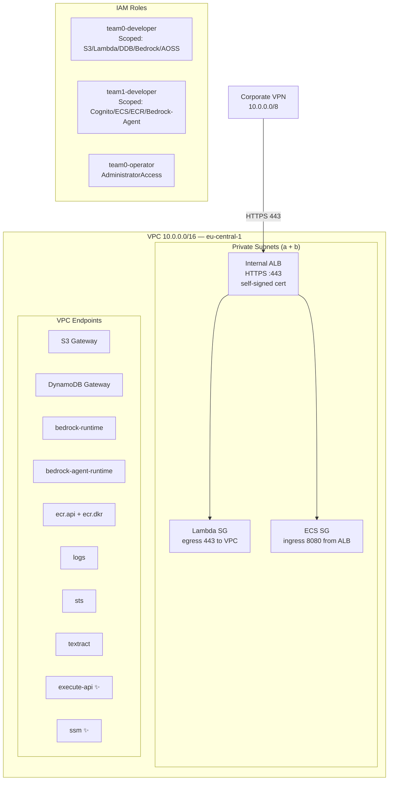
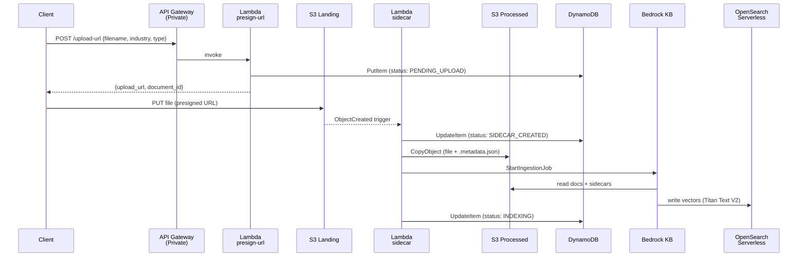
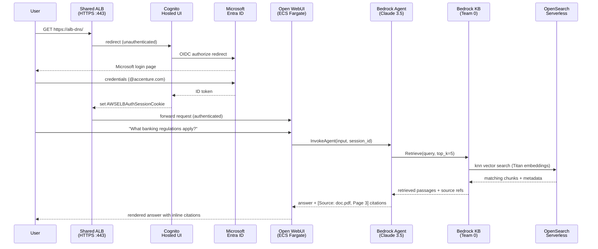

# Implementation Summary — HackatonSolutions Branch

> **Branch:** `HackatonSolutions`
> **Validated:** `terraform validate` passes on `shared`, `team0`, and `team1`
> **AWS credentials:** not available locally — `terraform plan` requires credentials (see bottom of this doc)

---

## Commits on This Branch

| SHA | Scope | Description |
|-----|-------|-------------|
| `4736871` | Shared infra | feat: VPC endpoints (execute-api, ssm), HTTPS ALB listener, IAM roles |
| `2e6e882` | M0 | feat(team0): implement Foundation & Ingestion milestone |
| `bcdd663` | M0 | fix(team0): switch vector store to OpenSearch Serverless |
| `f519175` | Rename | refactor: rename team1→team0, team2→team1 project-wide |
| `792da1e` | Merge | merge: integrate origin/main, resolve team0/team1 conflicts |
| `7d3d205` | Docs | docs: mark completed task checkboxes for both teams |
| `d1823ba` | M1 + Docs | feat(team1): full M1 Terraform + reorganize task files |
| `4b7183f` | Docs | docs: mark remaining M1 checkboxes; add tfvars to .gitignore |

---

## Team Structure

| Team | Members | Milestone | Definition of Done |
|------|---------|-----------|-------------------|
| **Team 0** | Aigul, Sandro | M0 — Foundation & Ingestion | Document uploaded → tagged → vectorized → retrievable with metadata filters |
| **Team 1** | Zoltan, Nikos, Yildrim, Nicolas | M1 — Access & Knowledge App | User logs in via SSO → asks question → gets cited answer from KB |

---

## Shared Infrastructure (Pre-provisioned)

### What Was Added to Existing Modules

| File | Change |
|------|--------|
| `terraform/modules/networking/main.tf` | + `execute-api` VPC Interface Endpoint (private API GW) |
| `terraform/modules/networking/main.tf` | + `ssm` VPC Interface Endpoint (Open WebUI secret key) |
| `terraform/modules/networking/main.tf` | + HTTPS ALB listener (port 443) with self-signed TLS cert |
| `terraform/modules/networking/outputs.tf` | Updated `endpoint_ids` map; + `alb_http_listener_arn` |
| `terraform/shared/main.tf` | + `hashicorp/tls` provider; + `team0-operator`, `team0-developer`, `team1-developer` IAM roles |
| `terraform/shared/outputs.tf` | + `team0_developer_role_arn`, `team1_developer_role_arn`, `team0_operator_role_arn`, `aws_account_id` |

### Network Architecture



---

## Team 0 — M0: Foundation & Ingestion

### Resources Implemented (`terraform/team0/`)

| Ticket | Resource | Notes |
|--------|----------|-------|
| M0-01 | `aws_dynamodb_table.documents` | PAY_PER_REQUEST; GSI `industry-uploaded_at-index` |
| M0-01 | `aws_s3_bucket_policy.processed_bedrock` | Grants Bedrock service principal read |
| M0-02 | `aws_lambda_function.presign` | Python 3.12, VPC, validates industry/type enums |
| M0-02 | `aws_api_gateway_rest_api.main` | PRIVATE type, VPC-source condition policy |
| M0-02 | `aws_api_gateway_resource/method/integration` | `POST /upload-url` → Lambda |
| M0-03 | `aws_lambda_function.sidecar` | Python 3.12, VPC; skips `.metadata.json` (no recursion) |
| M0-03 | `aws_s3_bucket_notification.landing_trigger` | S3 ObjectCreated → sidecar Lambda |
| M0-04 | `aws_opensearchserverless_collection.vectors` | VECTORSEARCH type |
| M0-04 | `aws_opensearchserverless_security_policy` × 2 | Encryption + network policies |
| M0-04 | `aws_opensearchserverless_access_policy.bedrock_kb` | Bedrock service principal access |
| M0-04 | `aws_bedrockagent_knowledge_base.main` | Titan Text Embeddings V2, HNSW/faiss L2 1024-dim |
| M0-04 | `aws_bedrockagent_data_source.processed` | Fixed-size 512 tokens / 20% overlap |
| M0-05 | `aws_lambda_function.digest` | Python 3.12; scans DDB, sends SES HTML email |
| M0-05 | `aws_cloudwatch_event_rule.weekly_digest` | `cron(0 8 ? * MON *)` |
| M0-05 | `aws_ses_email_identity.digest_sender` | Requires manual console verification |
| M0-05 | `aws_cloudwatch_metric_alarm` × 8 | Lambda errors/throttles (×3 functions) + API GW 5XX/latency |
| M0-05 | `aws_cloudwatch_dashboard.main` | `knowledge-base-team0` |
| M0-05 | `aws_sns_topic.alarms` + subscription | Email alerting |

### Upload → Index Flow



### Lambda Source Files

| Function | File | Purpose |
|----------|------|---------|
| presign | `terraform/team0/lambda/presigned_url/index.py` | Validates metadata, generates S3 PUT presigned URL, writes DynamoDB PENDING_UPLOAD |
| sidecar | `terraform/team0/lambda/sidecar/index.py` | S3-triggered; creates `.metadata.json`, copies to processed bucket, starts KB ingestion |
| digest | `terraform/team0/lambda/digest/index.py` | Weekly DDB scan, SES HTML email grouped by industry/type, triggers KB sync |
| index script | `terraform/team0/scripts/create_opensearch_index.py` | One-shot: creates knn vector index (1024-dim, HNSW, faiss, L2) in AOSS |

### Key Outputs (consumed by Team 1)

```bash
terraform -chdir=terraform/team0 output bedrock_kb_id    # → used in team1/main.tf
terraform -chdir=terraform/team0 output bedrock_kb_arn
terraform -chdir=terraform/team0 output landing_bucket_name
```

---

## Team 1 — M1: Access & Knowledge App

### Resources Implemented (`terraform/team1/`)

| Ticket | Resource | Notes |
|--------|----------|-------|
| M1-01 | `aws_cognito_user_pool.main` | email login only; `allow_admin_create_user_only = true` |
| M1-01 | `aws_cognito_user_pool_domain.main` | `${project}-${account_id}` prefix → hosted UI |
| M1-01 | `aws_cognito_identity_provider.entra` | OIDC; Entra ID discovery at `login.microsoftonline.com/${tenant}/v2.0` |
| M1-01 | `aws_cognito_user_pool_client.open_webui` | `generate_secret = true`; callback = ALB `/oauth2/idpresponse` |
| M1-02 | `aws_ecs_task_definition.open_webui` | 1 vCPU / 2 GiB; BEDROCK_AGENT_ID/ALIAS env vars; WEBUI_SECRET_KEY from SSM |
| M1-02 | `aws_ecs_service.open_webui` | Fargate; `desired_count = 1`; uses shared networking SGs |
| M1-02 | `aws_iam_role.ecs_task` | Runtime: InvokeAgent, Retrieve, RetrieveAndGenerate, SSM GetParameter |
| M1-02 | `aws_ssm_parameter.webui_secret_key` | SecureString; `lifecycle { ignore_changes = [value] }` |
| M1-03 | `aws_lb_target_group.chat_frontend` | ip/8080; health check `GET /health → 200` |
| M1-03 | `aws_lb_listener_rule.chat_frontend` | priority 100; authenticate-cognito → forward; 8h session |
| M1-04 | `aws_iam_role.bedrock_agent` | Trust: `bedrock.amazonaws.com` with source-account/ARN conditions |
| M1-04 | `aws_bedrockagent_agent.main` | Claude 3.5 Sonnet; `prepare_agent = true`; inline citation instruction |
| M1-04 | `aws_bedrockagent_agent_knowledge_base_association.main` | ENABLED; references Team 0 KB ID |
| M1-04 | `aws_bedrockagent_agent_alias.live` | Points to DRAFT during hackathon |
| compute module | `aws_ecr_repository.chat_frontend` | Image scanning enabled |
| compute module | `aws_ecs_cluster.main` | Container Insights enabled |
| compute module | `aws_iam_role.ecs_task_execution` | AmazonECSTaskExecutionRolePolicy |

### Login → Cited Answer Flow



### Key Outputs

```bash
terraform -chdir=terraform/team1 output app_url                  # → https://<alb-dns>
terraform -chdir=terraform/team1 output cognito_user_pool_id     # → register in Entra ID app
terraform -chdir=terraform/team1 output bedrock_agent_id         # → BEDROCK_AGENT_ID env var
terraform -chdir=terraform/team1 output bedrock_agent_alias_id   # → BEDROCK_AGENT_ALIAS_ID env var
terraform -chdir=terraform/team1 output ecr_repository_url       # → push Open WebUI image here
```

---

## Terraform Validate Results

```
$ terraform -chdir=terraform/shared validate
Success! The configuration is valid.

$ terraform -chdir=terraform/team0 validate
Success! The configuration is valid.

$ terraform -chdir=terraform/team1 validate
Success! The configuration is valid.
```

---

## Terraform Apply — How to Deploy

AWS credentials are required. Configure first (choose one method):

```bash
export AWS_PROFILE=hackathon
# or
export AWS_ACCESS_KEY_ID=... AWS_SECRET_ACCESS_KEY=... AWS_SESSION_TOKEN=...
```

Apply in order (each stack depends on the previous one's state):

```bash
# 1. Shared infra (VPC endpoints, ALB listener, IAM roles)
terraform -chdir=terraform/shared init && terraform -chdir=terraform/shared apply

# 2. Team 0 — M0 Foundation & Ingestion
terraform -chdir=terraform/team0 init && terraform -chdir=terraform/team0 apply

# 3. Team 1 — M1 Access & Knowledge App (needs team0 state for bedrock_kb_id)
terraform -chdir=terraform/team1 init && terraform -chdir=terraform/team1 apply
```

Set Entra ID secrets before applying team1 (never commit this file):

```bash
cat > terraform/team1/terraform.tfvars <<EOF
entra_tenant_id     = "<accenture-tenant-guid>"
entra_client_id     = "<app-registration-client-id>"
entra_client_secret = "<app-registration-client-secret>"
EOF
```

### Expected Plan Summary

| Stack | Resources to add |
|-------|-----------------|
| `shared` | ~10 (endpoints, HTTPS listener, IAM roles) |
| `team0` | ~38 (DynamoDB, 3× Lambda, API GW, AOSS, Bedrock KB, EventBridge, SES, CloudWatch) |
| `team1` | ~27 (Cognito, ECS service + task def, ALB TG + rule, SSM, Bedrock Agent + alias, IAM) |

### Manual Steps After Apply

| Step | Who | What |
|------|-----|------|
| Verify SES sender email | Team 0 | Click confirmation link in inbox for `digest_sender_email` |
| Enable Bedrock model access | Team 0 | AWS Console → Bedrock → Model access → enable Claude 3.5 Sonnet + Titan Text V2 |
| Register Entra redirect URI | Team 1 | Azure Portal → App Registration → add `https://<cognito-domain>/oauth2/idpresponse` |
| Push Open WebUI image to ECR | Team 1 | `docker pull ghcr.io/open-webui/open-webui:main`, tag, push to ECR URL |
| Update SSM secret key | Team 1 | AWS Console → Parameter Store → update `/knowledge-base/open-webui/secret-key` |
| Create OpenSearch index | Team 0 | `python terraform/team0/scripts/create_opensearch_index.py` (after AOSS collection is ACTIVE) |

---

## Key Design Decisions

| Decision | Rationale |
|----------|-----------|
| OpenSearch Serverless over S3 Vectors | Provider `~> 5.0` does not support `s3_configuration` in `aws_bedrockagent_knowledge_base`; AOSS is the proven path |
| Private API Gateway (PRIVATE type) | All traffic VPN-only; requires `execute-api` VPC endpoint added as part of shared infra |
| Self-signed TLS cert on ALB | Avoids ACM DNS validation delay during hackathon; Cognito auth requires HTTPS |
| Single shared Lambda execution role | DRY — all three M0 Lambdas need identical permissions |
| Digest Lambda outside VPC | DynamoDB via Gateway endpoint + SES via internet; avoids needing SES VPC endpoint |
| `for_each` on CloudWatch alarms | One alarm block covers all Lambda functions for both errors and throttles |
| `prepare_agent = true` on Bedrock Agent | Terraform calls `PrepareAgent` API after creation; agent must be PREPARED before InvokeAgent works |
| Cognito `allow_admin_create_user_only` | No self-registration; all users come exclusively via Entra ID SSO federation |
| ALB listener rule `authenticate-cognito` → `forward` | ALB handles auth before forwarding; Open WebUI does not need to implement OAuth itself |

---

## File Tree (changed files on this branch)

```
.gitignore                                   ← + *.tfvars, *.tfvars.json
docs/
├── implementation-summary.md                ← this file
├── Tickets/
│   ├── tasks_prerequisites.md               ← organizer setup (T0-01–T0-07)
│   ├── tasks_team0.md                       ← M0 Foundation tickets (Team 0)
│   └── tasks_team1.md                       ← M1 Access/App tickets (Team 1)
terraform/
├── modules/
│   ├── compute/
│   │   ├── main.tf                          ← ECR, ECS cluster, task execution role, ALB skeleton
│   │   └── outputs.tf                       ← + ecs_task_execution_role_arn/name
│   └── networking/
│       ├── main.tf                          ← + execute-api endpoint, ssm endpoint, HTTPS listener
│       └── outputs.tf                       ← updated endpoint_ids, + alb_http_listener_arn
├── shared/
│   ├── main.tf                              ← + tls provider, team0-operator/developer, team1-developer roles
│   └── outputs.tf                           ← + role ARNs, account_id
├── team0/
│   ├── main.tf                              ← full M0 (~38 resources)
│   ├── variables.tf                         ← + digest_sender/recipient_email
│   ├── outputs.tf                           ← bedrock_kb_id, landing_bucket_name, dashboard URL
│   ├── lambda/
│   │   ├── presigned_url/index.py
│   │   ├── sidecar/index.py
│   │   └── digest/index.py
│   └── scripts/
│       └── create_opensearch_index.py
└── team1/
    ├── main.tf                              ← full M1 (~27 resources)
    ├── variables.tf                         ← + entra_tenant/client_id/secret, open_webui_image
    └── outputs.tf                           ← cognito IDs, agent IDs, app_url
```
