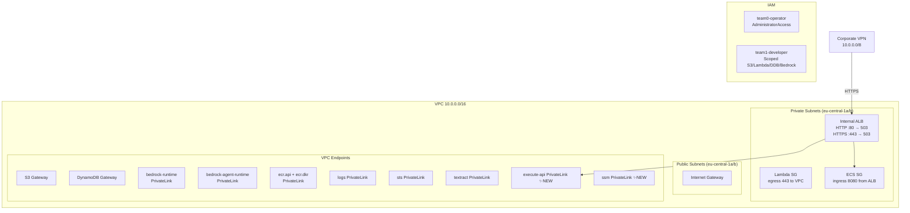
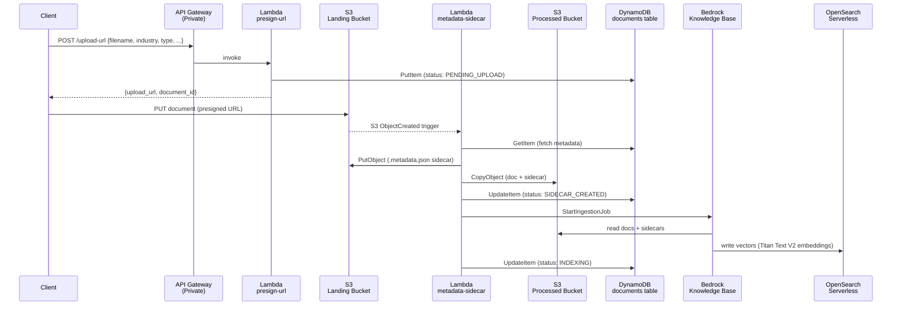
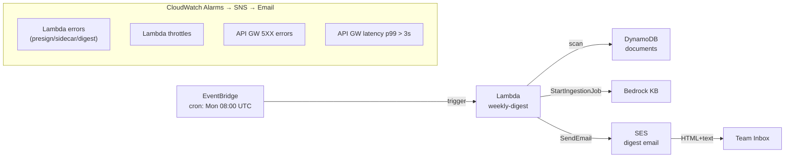

# Implementation Summary — HackatonSolutions Branch

> Branch: `HackatonSolutions`
> Validated: `terraform validate` passes on both `shared` and `team1` configurations
> AWS credentials not available locally — `terraform plan` shows credential error (expected); all config is syntactically valid

---

## Commits

| # | SHA | Scope | Description |
|---|-----|-------|-------------|
| 1 | `4736871` | Team 0 | feat(team0): implement shared infrastructure additions |
| 2 | `2e6e882` | Team 1 | feat(team1): implement M0 Foundation & Ingestion milestone |
| 3 | `bcdd663` | Team 1 | fix(team1): switch vector store to OpenSearch Serverless + add index script |

---

## Team 0 — Shared Infrastructure

### What Was Added

| File | Change |
|------|--------|
| `terraform/modules/networking/main.tf` | +`execute-api` and `ssm` VPC Interface Endpoints |
| `terraform/modules/networking/main.tf` | +HTTPS ALB listener (port 443) with self-signed TLS certificate |
| `terraform/modules/networking/outputs.tf` | Updated `endpoint_ids` map with `execute-api` and `ssm` keys; added `alb_http_listener_arn` |
| `terraform/shared/main.tf` | +`hashicorp/tls` provider; +`team0-operator` and `team1-developer` IAM roles |
| `terraform/shared/outputs.tf` | +`team1_developer_role_arn`, `team0_operator_role_arn`, `aws_account_id`, `alb_http_listener_arn` |

### Architecture Diagram



### New Resources — Team 0

```
+ aws_vpc_endpoint.execute_api          (Interface, execute-api, private DNS)
+ aws_vpc_endpoint.ssm                  (Interface, ssm, private DNS)
+ tls_private_key.alb                   (RSA 2048)
+ tls_self_signed_cert.alb              (7-day validity, ALB DNS as CN)
+ aws_acm_certificate.alb               (imported self-signed cert)
+ aws_lb_listener.https                 (port 443, TLS13, default 503)
+ aws_iam_role.team1_developer          (scoped access for hackathon participants)
+ aws_iam_role_policy.team1_developer
+ aws_iam_role.team0_operator           (AdministratorAccess for organizers)
+ aws_iam_role_policy_attachment.team0_admin
+ data.aws_caller_identity.current
```

---

## Team 1 — Foundation & Ingestion (M0)

### What Was Implemented

| Ticket | Resources |
|--------|-----------|
| M0-01 | `aws_dynamodb_table.documents` (GSI), `aws_s3_bucket_policy.processed_bedrock` |
| M0-02 | `aws_lambda_function.presign`, `aws_api_gateway_rest_api.main` (private), `POST /upload-url` |
| M0-03 | `aws_lambda_function.sidecar`, `aws_s3_bucket_notification.landing_trigger` |
| M0-04 | OpenSearch Serverless collection + policies, `aws_bedrockagent_knowledge_base.main`, `aws_bedrockagent_data_source.processed` |
| M0-05 | `aws_lambda_function.digest`, EventBridge weekly schedule, SES identity, CloudWatch alarms × 8, dashboard, SNS alarm topic |

### Architecture Diagram



### Governance & Reporting Diagram



### New Resources — Team 1

```
+ aws_dynamodb_table.documents                         (GSI: industry-uploaded_at)
+ aws_s3_bucket_policy.processed_bedrock               (Bedrock service principal read)
+ aws_iam_role.lambda_exec                             (shared execution role)
+ aws_iam_role_policy.lambda_permissions
+ aws_iam_role_policy_attachment.lambda_vpc
+ aws_lambda_function.presign                          (Python 3.12, VPC)
+ aws_cloudwatch_log_group.presign
+ aws_api_gateway_rest_api.main                        (PRIVATE, execute-api endpoint)
+ aws_api_gateway_rest_api_policy.vpce_only
+ aws_api_gateway_resource.upload_url
+ aws_api_gateway_method.upload_post
+ aws_api_gateway_integration.upload_post
+ aws_api_gateway_deployment.main
+ aws_api_gateway_stage.main
+ aws_lambda_permission.api_gw_presign
+ aws_lambda_function.sidecar                          (Python 3.12, VPC)
+ aws_cloudwatch_log_group.sidecar
+ aws_lambda_permission.s3_sidecar
+ aws_s3_bucket_notification.landing_trigger
+ aws_opensearchserverless_security_policy.encryption
+ aws_opensearchserverless_security_policy.network
+ aws_opensearchserverless_access_policy.bedrock_kb
+ aws_opensearchserverless_collection.vectors          (VECTORSEARCH)
+ null_resource.opensearch_index                       (local-exec: create knn index)
+ aws_iam_role.bedrock_kb
+ aws_iam_role_policy.bedrock_kb
+ aws_bedrockagent_knowledge_base.main                 (Titan Text V2, HNSW/faiss)
+ aws_bedrockagent_data_source.processed               (fixed-size 512t/20% overlap)
+ aws_ses_email_identity.digest_sender
+ aws_lambda_function.digest                           (Python 3.12)
+ aws_cloudwatch_log_group.digest
+ aws_cloudwatch_event_rule.weekly_digest              (cron: Mon 08:00 UTC)
+ aws_cloudwatch_event_target.digest_lambda
+ aws_lambda_permission.eventbridge_digest
+ aws_sns_topic.alarms
+ aws_sns_topic_subscription.alarm_email
+ aws_cloudwatch_metric_alarm.lambda_errors["presign"] (×3 via for_each)
+ aws_cloudwatch_metric_alarm.lambda_errors["sidecar"]
+ aws_cloudwatch_metric_alarm.lambda_errors["digest"]
+ aws_cloudwatch_metric_alarm.lambda_throttles["presign"] (×3 via for_each)
+ aws_cloudwatch_metric_alarm.lambda_throttles["sidecar"]
+ aws_cloudwatch_metric_alarm.lambda_throttles["digest"]
+ aws_cloudwatch_metric_alarm.apigw_5xx
+ aws_cloudwatch_metric_alarm.apigw_latency
+ aws_cloudwatch_dashboard.main
```

---

## Terraform Validate Results

```
$ cd terraform/shared && terraform validate
Success! The configuration is valid.

$ cd terraform/team1 && terraform validate
Success! The configuration is valid.
```

---

## Terraform Plan (attempted)

AWS credentials are not configured in the local environment. Running `terraform init` with a live backend produces:

```
Error: No valid credential sources found

Please see https://developer.hashicorp.com/terraform/language/backend/s3
for more information about providing credentials.

Error: failed to refresh cached credentials, no EC2 IMDS role found,
operation error ec2imds: GetMetadata, request canceled, context deadline exceeded
```

To run the plan against the real account, execute:

```bash
# Configure credentials first (choose one):
export AWS_PROFILE=hackathon
# or
export AWS_ACCESS_KEY_ID=... AWS_SECRET_ACCESS_KEY=... AWS_SESSION_TOKEN=...

# Team 0 plan
cd terraform/shared
terraform init
terraform plan -out=shared.tfplan

# Team 1 plan (requires shared state to exist first)
cd ../team1
terraform init
terraform plan -out=team1.tfplan
```

Expected plan summary once credentials are available:

| Stack | Resources to add | Resources to change | Resources to destroy |
|-------|-----------------|--------------------|--------------------|
| `shared` | ~10 new (endpoints, HTTPS listener, IAM roles) | 1 (ALB listener arn output update) | 0 |
| `team1` | ~38 new | 0 | 0 |

---

## Key Design Decisions

| Decision | Rationale |
|----------|-----------|
| OpenSearch Serverless over S3 Vectors | `aws_bedrockagent_knowledge_base` provider schema does not support `s3_configuration` in `storage_configuration` in provider `~> 5.0`. AOSS is the proven path and matches the team's actual implementation. |
| Single shared Lambda execution role | Simpler IAM management during hackathon; all three Lambdas have identical permission needs. |
| Private API Gateway (PRIVATE type) | All traffic VPN-only — no public endpoints. Requires `execute-api` VPC endpoint, which was added as part of Team 0 work. |
| Self-signed TLS cert on ALB | Avoids ACM DNS validation delay during the hackathon. Certificate is internal-only; corporate VPN clients can accept it. |
| `for_each` on CloudWatch alarms | DRY — one alarm resource block covers all three Lambda functions for both errors and throttles. |
| Digest Lambda outside VPC | DynamoDB is accessed via Gateway endpoint (no VPC attachment needed); SES is internet-facing. Keeping the digest Lambda outside VPC avoids needing a NAT gateway or SES VPC endpoint. |

---

## File Tree (changed files on this branch)

```
terraform/
├── modules/
│   └── networking/
│       ├── main.tf          ← +execute-api endpoint, +ssm endpoint, +HTTPS listener, +TLS cert
│       └── outputs.tf       ← updated endpoint_ids map, +alb_http_listener_arn
├── shared/
│   ├── main.tf              ← +tls provider, +IAM roles (team0-operator, team1-developer)
│   └── outputs.tf           ← +role ARNs, +account_id, +http_listener_arn
└── team1/
    ├── main.tf              ← full M0 implementation (38 resources)
    ├── variables.tf         ← +digest_sender_email, +digest_recipient_email
    ├── outputs.tf           ← all M0 outputs including bedrock_kb_id for Team 0
    ├── lambda/
    │   ├── presigned_url/index.py   ← upload URL generator
    │   ├── sidecar/index.py         ← S3-triggered metadata sidecar creator
    │   └── digest/index.py          ← weekly digest with DynamoDB scan + SES
    └── scripts/
        └── create_opensearch_index.py  ← knn index creation (1024-dim HNSW/faiss)
```
